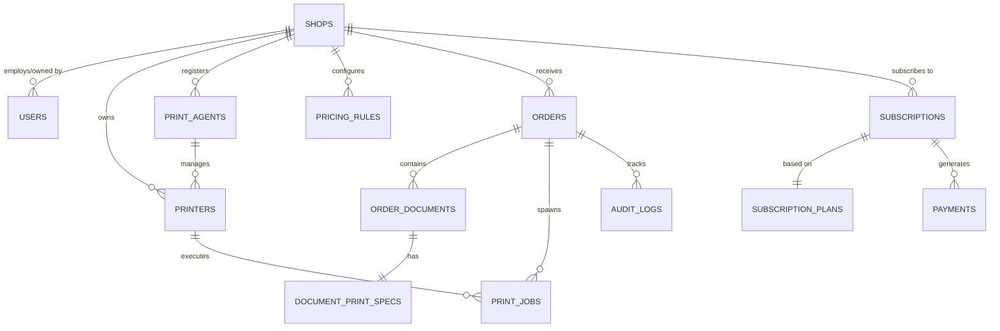

# SMART PRINT HUB — System Architecture & Product Blueprint
**Document Version:** 1.0.0  
**Phase:** Milestone 0 — Product & Architecture Definition  
**Date:** October 2026  
**Status:** Approved for Implementation Planning  

---

## 1. Executive Summary

**SMART PRINT HUB** is a high-reliability, multi-tenant Software-as-a-Service (SaaS) workflow automation platform engineered specifically for Xerox, print shops, and copy centers. 

The traditional print shop operational model suffers from critical friction points:
1. **Unorganized Document Ingestion:** Customers transmit documents haphazardly through consumer messaging channels (WhatsApp, Telegram) or personal email.
2. **Manual Configuration Bottleneck:** Shop staff must manually inspect files, download attachments to local storage, open each document in desktop viewers, query the customer repeatedly about settings (color, copies, duplex, page range), and manually configure printer driver dialogs.
3. **Queue Chaos & Security Vulnerabilities:** Unmanaged customer documents accumulate on desktop folders, presenting severe privacy liabilities. Peak shop hours result in lost orders, misprints, wasted paper/toner, and extended customer wait times.

SMART PRINT HUB solves this via a decoupled, four-tier architecture:
- **Customer Mobile Web App:** Zero-install, scan-to-order interface accessed via a unique shop QR code. Customers upload documents, configure granular print specifications (per-document or batch "apply-to-all"), review calculated pricing, and receive a trackable order reference number.
- **Central Cloud Platform & API:** Multi-tenant order management, dynamic pricing calculation, role-based access control, file storage orchestrator, and real-time event distribution.
- **Shop Owner Operations Dashboard:** Streamlined command center displaying real-time incoming orders, specification editing tools, printer queue controls, and operational metrics.
- **Local Print Agent (Windows Service / Daemon):** A secure background agent operating on the shop's local Windows computer that interfaces directly with the Windows Print Spooler, executes automated silent print pipelines, and queries printer hardware telemetry via SNMP and Windows APIs.

---

## 2. Recommended Technology Stack

| Layer | Selected Technology | Rationale & Trade-offs |
|---|---|---|
| **Customer Web App** | **Next.js 14+ / React 18, TypeScript, Tailwind CSS** | Mobile-first responsiveness, minimal bundle size, fast Time-To-Interactive (TTI), built-in image and asset optimization, client-side PDF inspection via `pdfjs-dist`. |
| **Owner Dashboard** | **Next.js 14+ / React, TypeScript, Tailwind CSS, Lucide Icons, Shadcn UI** | High-density data grid, real-time reactive order streams, desktop ergonomics, modular component architecture. |
| **Backend & API** | **Node.js with Fastify / Express (TypeScript) + WebSocket Server (`ws`)** | High-throughput asynchronous I/O, native JSON handling, low memory overhead, unified TypeScript typing across frontend, backend, and agent. |
| **Database** | **PostgreSQL 16** | Robust relational model, strict ACID compliance, powerful JSONB capabilities for extensible finishing options, foreign key constraints, connection pooling via PgBouncer. |
| **ORM / Migration** | **Prisma ORM** | Type-safe queries, automated schema migrations, zero runtime overhead for typings, seamless developer ergonomics. |
| **Object Storage** | **S3-Compatible Storage (MinIO for dev, AWS S3 / Cloudflare R2 for prod)** | Secure pre-signed upload/download URLs with strict 15-minute TTL; decoupled from application disk; automatic lifecycle rules for 24-hour document purging. |
| **Real-time Engine** | **WebSockets (`ws`) with Fallback to SSE** | Sub-100ms bi-directional communication for print agent control, order status streaming, and owner notifications without polling overhead. |
| **Document Processor** | **LibreOffice Headless + PDF-Lib / Poppler utilities (Containerized)** | Server-side conversion of DOC, DOCX, and images to standardized PDF/A with exact page counting before routing to the print queue. |
| **Local Print Agent** | **Node.js Core Daemon packaged via `pkg` / C# .NET Worker** | Native Windows Win32 Print Spooler integration via PowerShell/P/Invoke, raw SNMP v2c/v3 client (`net-snmp`), Ghostscript & SumatraPDF CLI wrapper for silent background printing. |
| **Payment Gateway** | **Pluggable Payment Engine (Razorpay for India, Stripe for Global)** | Secure checkout modal, zero raw card data liability, HMAC-SHA256 webhook verification, automated GST invoice generation. |

---

## 3. Overall System Architecture & Data Flow

```
                      +------------------------------------------+
                      |         CUSTOMER MOBILE INTERFACE         |
                      |   (Mobile Browser - Scan Shop QR Code)   |
                      +------------------------------------------+
                                           |
                              HTTPS / Pre-Signed S3 Upload
                                           |
                                           v
+--------------------+        +---------------------------+        +--------------------+
|   OBJECT STORAGE   |<-------|   CLOUD GATEWAY & API     |------->|   POSTGRESQL DB    |
|   (S3 / MinIO)     |------->|   (Fastify / Node.js)     |<-------|   (Multi-Tenant)   |
|   - Encrypted at Rest       +---------------------------+        +--------------------+
|   - 15m Expiring URLs                     ^
+--------------------+                      |
                                            | WebSockets (TLS)
                                            | Real-Time Event Bus
                                            v
                      +------------------------------------------+
                      |          SHOP OWNER DASHBOARD            |
                      |  (Desktop Web UI - Real-time Queue/Specs)|
                      +------------------------------------------+
                                            ^
                                            |
                      +------------------------------------------+
                      |         LOCAL PRINT AGENT (PC)           |
                      |    (Windows Background Service / WSS)    |
                      +------------------------------------------+
                           |                              |
            Windows Spooler API (Win32)          SNMP v2c/v3 (UDP 161)
                           |                              |
                           v                              v
              +-------------------------+    +-------------------------+
              |   USB / SPOOLED PRINTER |    |  NETWORK XEROX / MFP    |
              |   (Canon, HP, Brother)  |    |  (Ricoh, Xerox, Konica) |
              +-------------------------+    +-------------------------+
```

### End-to-End Operational Lifecycle:
1. **Discovery:** Customer scans the physical shop QR code containing `https://smartprinthub.com/s/{shopSlug}`.
2. **Customer Input:** Customer enters Name & Phone. Frictionless session is minted.
3. **Upload & Pre-flight:** Customer uploads PDF/DOCX/JPG files directly to S3 via pre-signed URLs. Client-side/server-side pre-flight inspects total page counts.
4. **Specification Configuration:** Customer selects copies, color mode (B&W vs. Color), duplex (single vs. double-sided), paper size (A4, A3, Letter), orientation, and page ranges. Settings can be applied per-file or batch-applied.
5. **Dynamic Costing & Submission:** Backend pricing engine evaluates the shop's active rate card and returns an exact estimated total. The customer reviews and submits. Order ID `SPH-YYYYMMDD-XXXXXX` is generated.
6. **Owner Dispatch:** The order instantly appears on the Owner Dashboard via WebSocket with audio/visual notification. The owner reviews the files and settings, optionally edits specifications (e.g., changes B&W to Color if requested verbally), and clicks **Print Order**.
7. **Agent Execution:** The backend sends a `PRINT_JOB_DISPATCH` packet to the shop's paired Local Print Agent over an authenticated WebSocket.
8. **Silent Printing & Telemetry:** The Print Agent downloads the document via short-lived expiring URL, invokes SumatraPDF/Ghostscript to dispatch the job to the target Windows printer with hardware-matched settings, and listens for Windows spooler completion codes.
9. **Status Notification:** Spooler success triggers an event back through the Cloud API to advance the customer's tracking stepper to `COMPLETED`.

---

## 4. Workflows

### 4.1. Customer Workflow
```
[Scan QR] 
   --> [Shop Landing Page (/s/{shopCode})]
   --> [Enter Contact Information (Name, Phone)]
   --> [Upload Files (Drag-Drop / File Picker / Camera)]
   --> [Configure Document Specs (Per-item or Apply-to-All)]
   --> [Live Price Preview]
   --> [Review Order Summary]
   --> [Submit Print Request]
   --> [Receive Unique Reference: SPH-20261001-000123]
   --> [Real-time Status Stepper (Submitted -> Reviewing -> Queued -> Printing -> Ready)]
```

### 4.2. Owner Workflow
```
[Owner Login / Register]
   --> [Shop Setup: Name, Address, Working Hours, GST]
   --> [Configure Pricing Rules: B&W, Color, A4, A3, Duplex, Finishing]
   --> [Download & Print Branded QR Standee / Poster]
   --> [Pair Windows Print Agent (Enter 6-digit Agent Token)]
   --> [Live Order Feed (Incoming Orders Flash Green)]
   --> [Inspect Order: View PDF Preview, Verify Page Count, Adjust Specs]
   --> [Click "Print Order" -> Automatic / Manual Printer Selection]
   --> [Monitor Print Job Progress & Hardware Status]
   --> [Mark Order as "Ready for Pickup" / "Completed"]
```

### 4.3. Print Agent Workflow
```
[Agent Installed on Windows PC as Background Service]
   --> [Prompt for One-Time Shop Pairing Secret]
   --> [Establish WSS Connection to Cloud with TLS 1.3]
   --> [Enumerate Local Windows Printers (PowerShell/Win32 Spooler API)]
   --> [Probe Network Printers for SNMP MIB Support]
   --> [Send Inventory & Health Heartbeat to Backend (every 30s)]
   --> [Receive `PRINT_JOB_DISPATCH` Command]
   --> [Verify Payload Signature (HMAC-SHA256)]
   --> [Download Document Stream to Temp Sandbox (InMemory / Encrypted Disk)]
   --> [Generate CLI Print Invocation with Target Driver DevMode Flags]
   --> [Submit to Windows Spooler]
   --> [Poll Spooler Job ID until Printed / Failed]
   --> [Emit `JOB_COMPLETED` / `JOB_FAILED` back to Cloud]
   --> [Securely Purge Temp File (Zero-Fill Deletion)]
```

---

## 5. Printer Communication & Monitoring Architecture

Physical Xerox and printing devices fall into three operational tiers:

```
+-----------------------------------------------------------------------------------+
|                            PRINTER ABSTRACTION LAYER                              |
|                              (IPrinterDeviceAdapter)                              |
+-----------------------------------------------------------------------------------+
          |                                  |                               |
          v                                  v                               v
+--------------------+             +--------------------+          +--------------------+
|  Windows Spooler   |             |   SNMP v2c / v3    |          |  Vendor SDK / API  |
|      Adapter       |             |      Adapter       |          |      Adapter       |
+--------------------+             +--------------------+          +--------------------+
| - USB & Network    |             | - Network MFPs     |          | - Enterprise Xerox |
| - Job spool status |             | - RFC 3805 MIB     |          | - Canon MEAP       |
| - Driver settings  |             | - Paper tray status|          | - HP Web Jetadmin  |
| - Queue count      |             | - Toner levels (%) |          | - Proprietary stats|
+--------------------+             +--------------------+          +--------------------+
```

### Explicit Tri-State Status Model
A common failure of printer management software is assuming that an unqueried metric is "Good" or "False". SMART PRINT HUB strictly uses an explicit tri-state model:
- `TRUE`: Hardware affirmatively confirmed the state (e.g., Paper Out sensor triggered).
- `FALSE`: Hardware affirmatively confirmed the state is clear.
- `UNKNOWN`: The printer or driver protocol does not expose this metric, or the device is unreachable. **The UI explicitly renders "Unknown" with neutral styling. Fabricated telemetry is strictly prohibited.**

Supported States:
`ONLINE` | `OFFLINE` | `PRINTING` | `PAUSED` | `PAPER_LOW` | `PAPER_EMPTY` | `TONER_LOW` | `TONER_EMPTY` | `PAPER_JAM` | `DOOR_OPEN` | `ERROR` | `UNKNOWN`

---

## 6. Database ER Model (Relational Schema)



### Table Definitions:

```sql
-- 1. Tenants (Shops)
CREATE TABLE shops (
    id UUID PRIMARY KEY DEFAULT gen_random_uuid(),
    slug VARCHAR(64) UNIQUE NOT NULL,
    name VARCHAR(255) NOT NULL,
    phone VARCHAR(32) NOT NULL,
    email VARCHAR(255) NOT NULL,
    address TEXT,
    city VARCHAR(100),
    state VARCHAR(100),
    pincode VARCHAR(20),
    gst_number VARCHAR(32),
    qr_code_url TEXT,
    is_active BOOLEAN DEFAULT TRUE,
    created_at TIMESTAMP WITH TIME ZONE DEFAULT NOW(),
    updated_at TIMESTAMP WITH TIME ZONE DEFAULT NOW()
);

-- 2. Users (Owners, Staff, System Admins)
CREATE TYPE user_role AS ENUM ('SUPER_ADMIN', 'SHOP_OWNER', 'SHOP_OPERATOR');
CREATE TABLE users (
    id UUID PRIMARY KEY DEFAULT gen_random_uuid(),
    shop_id UUID REFERENCES shops(id) ON DELETE CASCADE,
    email VARCHAR(255) UNIQUE NOT NULL,
    password_hash VARCHAR(255) NOT NULL,
    full_name VARCHAR(255) NOT NULL,
    phone VARCHAR(32),
    role user_role DEFAULT 'SHOP_OWNER',
    is_verified BOOLEAN DEFAULT FALSE,
    created_at TIMESTAMP WITH TIME ZONE DEFAULT NOW(),
    updated_at TIMESTAMP WITH TIME ZONE DEFAULT NOW()
);

-- 3. Customers (Frictionless / Ephemeral or Registered)
CREATE TABLE customers (
    id UUID PRIMARY KEY DEFAULT gen_random_uuid(),
    shop_id UUID REFERENCES shops(id) ON DELETE CASCADE,
    phone VARCHAR(32) NOT NULL,
    full_name VARCHAR(255) NOT NULL,
    email VARCHAR(255),
    created_at TIMESTAMP WITH TIME ZONE DEFAULT NOW()
);
CREATE INDEX idx_customers_shop_phone ON customers(shop_id, phone);

-- 4. Orders
CREATE TYPE order_status AS ENUM (
    'SUBMITTED', 'RECEIVED', 'REVIEWING', 'QUEUED', 
    'PRINTING', 'READY', 'COMPLETED', 'CANCELLED', 'FAILED'
);
CREATE TABLE orders (
    id UUID PRIMARY KEY DEFAULT gen_random_uuid(),
    order_number VARCHAR(32) UNIQUE NOT NULL, -- SPH-YYYYMMDD-XXXXXX
    shop_id UUID NOT NULL REFERENCES shops(id) ON DELETE CASCADE,
    customer_id UUID NOT NULL REFERENCES customers(id),
    status order_status DEFAULT 'SUBMITTED',
    total_documents INT NOT NULL DEFAULT 1,
    total_pages INT NOT NULL DEFAULT 1,
    estimated_amount NUMERIC(10, 2) NOT NULL DEFAULT 0.00,
    final_amount NUMERIC(10, 2),
    customer_notes TEXT,
    rejection_reason TEXT,
    created_at TIMESTAMP WITH TIME ZONE DEFAULT NOW(),
    updated_at TIMESTAMP WITH TIME ZONE DEFAULT NOW()
);
CREATE INDEX idx_orders_shop_status ON orders(shop_id, status);

-- 5. Order Documents
CREATE TABLE order_documents (
    id UUID PRIMARY KEY DEFAULT gen_random_uuid(),
    order_id UUID NOT NULL REFERENCES orders(id) ON DELETE CASCADE,
    original_filename VARCHAR(255) NOT NULL,
    storage_key VARCHAR(512) NOT NULL,
    file_size_bytes BIGINT NOT NULL,
    mime_type VARCHAR(128) NOT NULL,
    sha256_checksum VARCHAR(64) NOT NULL,
    detected_page_count INT DEFAULT 1,
    preview_image_key VARCHAR(512),
    created_at TIMESTAMP WITH TIME ZONE DEFAULT NOW()
);

-- 6. Document Print Specifications
CREATE TYPE color_mode AS ENUM ('BW', 'COLOR');
CREATE TYPE duplex_mode AS ENUM ('SIMPLEX', 'DUPLEX_LONG_EDGE', 'DUPLEX_SHORT_EDGE');
CREATE TYPE paper_size AS ENUM ('A4', 'A3', 'A5', 'LETTER', 'LEGAL', 'CUSTOM');
CREATE TYPE page_orientation AS ENUM ('PORTRAIT', 'LANDSCAPE', 'AUTO');

CREATE TABLE document_print_specs (
    id UUID PRIMARY KEY DEFAULT gen_random_uuid(),
    document_id UUID UNIQUE NOT NULL REFERENCES order_documents(id) ON DELETE CASCADE,
    copies INT NOT NULL DEFAULT 1,
    color color_mode NOT NULL DEFAULT 'BW',
    duplex duplex_mode NOT NULL DEFAULT 'SIMPLEX',
    paper_size paper_size NOT NULL DEFAULT 'A4',
    orientation page_orientation NOT NULL DEFAULT 'AUTO',
    page_range VARCHAR(64) DEFAULT 'ALL', -- 'ALL' or '1-5,8'
    pages_per_sheet INT DEFAULT 1, -- 1, 2, 4, 6
    collate BOOLEAN DEFAULT TRUE,
    stapling VARCHAR(32) DEFAULT 'NONE', -- 'NONE', 'CORNER', 'SIDE'
    finishing_notes TEXT,
    price_calculation JSONB,
    created_at TIMESTAMP WITH TIME ZONE DEFAULT NOW(),
    updated_at TIMESTAMP WITH TIME ZONE DEFAULT NOW()
);

-- 7. Local Print Agents
CREATE TABLE print_agents (
    id UUID PRIMARY KEY DEFAULT gen_random_uuid(),
    shop_id UUID NOT NULL REFERENCES shops(id) ON DELETE CASCADE,
    agent_name VARCHAR(128) NOT NULL,
    machine_hostname VARCHAR(255),
    os_version VARCHAR(128),
    auth_token_hash VARCHAR(255) NOT NULL,
    is_connected BOOLEAN DEFAULT FALSE,
    last_heartbeat_at TIMESTAMP WITH TIME ZONE,
    created_at TIMESTAMP WITH TIME ZONE DEFAULT NOW()
);

-- 8. Printers
CREATE TABLE printers (
    id UUID PRIMARY KEY DEFAULT gen_random_uuid(),
    shop_id UUID NOT NULL REFERENCES shops(id) ON DELETE CASCADE,
    agent_id UUID REFERENCES print_agents(id) ON DELETE SET NULL,
    windows_printer_name VARCHAR(255) NOT NULL,
    display_name VARCHAR(255) NOT NULL,
    manufacturer VARCHAR(128),
    model VARCHAR(128),
    connection_type VARCHAR(32) DEFAULT 'WINDOWS_SPOOLER', -- 'USB', 'NETWORK', 'SPOOLER'
    ip_address VARCHAR(45),
    supports_color BOOLEAN DEFAULT FALSE,
    supports_duplex BOOLEAN DEFAULT FALSE,
    supported_paper_sizes VARCHAR(32)[] DEFAULT '{"A4"}',
    status VARCHAR(32) DEFAULT 'UNKNOWN',
    is_active BOOLEAN DEFAULT TRUE,
    current_queue_count INT DEFAULT 0,
    created_at TIMESTAMP WITH TIME ZONE DEFAULT NOW(),
    updated_at TIMESTAMP WITH TIME ZONE DEFAULT NOW()
);

-- 9. Print Jobs
CREATE TYPE print_job_status AS ENUM (
    'PENDING', 'ASSIGNED', 'DOWNLOADING', 'SPOOLING', 
    'PRINTING', 'SUCCESS', 'FAILED', 'CANCELLED'
);
CREATE TABLE print_jobs (
    id UUID PRIMARY KEY DEFAULT gen_random_uuid(),
    order_id UUID NOT NULL REFERENCES orders(id) ON DELETE CASCADE,
    document_id UUID NOT NULL REFERENCES order_documents(id) ON DELETE CASCADE,
    printer_id UUID REFERENCES printers(id) ON DELETE SET NULL,
    agent_id UUID REFERENCES print_agents(id) ON DELETE SET NULL,
    status print_job_status DEFAULT 'PENDING',
    spooler_job_id INT,
    error_message TEXT,
    dispatched_at TIMESTAMP WITH TIME ZONE,
    completed_at TIMESTAMP WITH TIME ZONE,
    created_at TIMESTAMP WITH TIME ZONE DEFAULT NOW()
);

-- 10. Pricing Rules
CREATE TABLE pricing_rules (
    id UUID PRIMARY KEY DEFAULT gen_random_uuid(),
    shop_id UUID NOT NULL REFERENCES shops(id) ON DELETE CASCADE,
    paper_size paper_size NOT NULL DEFAULT 'A4',
    bw_single_price NUMERIC(6, 2) NOT NULL DEFAULT 2.00,
    bw_double_price NUMERIC(6, 2) NOT NULL DEFAULT 3.00,
    color_single_price NUMERIC(6, 2) NOT NULL DEFAULT 10.00,
    color_double_price NUMERIC(6, 2) NOT NULL DEFAULT 18.00,
    is_active BOOLEAN DEFAULT TRUE,
    created_at TIMESTAMP WITH TIME ZONE DEFAULT NOW(),
    UNIQUE(shop_id, paper_size)
);

-- 11. SaaS Subscriptions & Billing
CREATE TABLE subscription_plans (
    id VARCHAR(32) PRIMARY KEY, -- 'STARTER', 'PRO', 'BUSINESS'
    name VARCHAR(64) NOT NULL,
    monthly_price NUMERIC(10, 2) NOT NULL,
    yearly_price NUMERIC(10, 2) NOT NULL,
    max_printers INT NOT NULL,
    max_monthly_orders INT NOT NULL,
    features JSONB NOT NULL
);

CREATE TABLE subscriptions (
    id UUID PRIMARY KEY DEFAULT gen_random_uuid(),
    shop_id UUID UNIQUE NOT NULL REFERENCES shops(id) ON DELETE CASCADE,
    plan_id VARCHAR(32) NOT NULL REFERENCES subscription_plans(id),
    status VARCHAR(32) DEFAULT 'TRIALING', -- 'TRIALING', 'ACTIVE', 'PAST_DUE', 'CANCELLED'
    trial_start_at TIMESTAMP WITH TIME ZONE DEFAULT NOW(),
    trial_end_at TIMESTAMP WITH TIME ZONE DEFAULT (NOW() + INTERVAL '30 days'),
    current_period_start TIMESTAMP WITH TIME ZONE,
    current_period_end TIMESTAMP WITH TIME ZONE,
    created_at TIMESTAMP WITH TIME ZONE DEFAULT NOW()
);

-- 12. Audit Logs
CREATE TABLE audit_logs (
    id UUID PRIMARY KEY DEFAULT gen_random_uuid(),
    shop_id UUID REFERENCES shops(id) ON DELETE CASCADE,
    user_id UUID REFERENCES users(id) ON DELETE SET NULL,
    action VARCHAR(64) NOT NULL,
    entity_type VARCHAR(64) NOT NULL,
    entity_id VARCHAR(64) NOT NULL,
    details JSONB,
    ip_address VARCHAR(45),
    created_at TIMESTAMP WITH TIME ZONE DEFAULT NOW()
);
```

---

## 7. API Architecture & WebSocket Protocol

### 7.1. RESTful Endpoints
```text
AUTH & ONBOARDING
  POST   /api/v1/auth/register-owner           Register new shop owner
  POST   /api/v1/auth/login                    Owner login (returns JWT httpOnly cookie)
  POST   /api/v1/auth/logout                   Invalidate session token
  GET    /api/v1/auth/me                       Current authenticated principal

SHOPS & QR
  GET    /api/v1/shops/:shopSlug/public        Public shop metadata for customer scan
  GET    /api/v1/shops/qr/generate             Generate SVG/PNG shop standee
  PUT    /api/v1/shops/profile                 Update shop profile (address, phone, hours)

DOCUMENTS & UPLOADS
  POST   /api/v1/uploads/presigned-url         Generate signed S3 PUT URL + validation token
  POST   /api/v1/uploads/verify                Verify upload checksum, detect page count

CUSTOMER ORDERS
  POST   /api/v1/orders/submit                 Submit customer order with specifications
  GET    /api/v1/orders/track/:orderNumber     Public status tracking endpoint

OWNER ORDER MANAGEMENT
  GET    /api/v1/owner/orders                  List orders with filtering (status, date)
  GET    /api/v1/owner/orders/:id              Detailed order view with documents & specs
  PATCH  /api/v1/owner/orders/:id/specs        Owner overrides customer specifications
  POST   /api/v1/owner/orders/:id/dispatch     Dispatch order to target printer
  PATCH  /api/v1/owner/orders/:id/status       Update order status (READY, COMPLETED, etc.)

PRINTERS & AGENTS
  POST   /api/v1/agent/pair                    Pair Windows agent with Shop token
  GET    /api/v1/owner/printers                List detected printers & capabilities
  PATCH  /api/v1/owner/printers/:id            Update printer alias, paper trays, active status

SUBSCRIPTIONS & BILLING
  GET    /api/v1/billing/plans                 List available subscription tiers
  POST   /api/v1/billing/checkout              Initialize subscription checkout session
  POST   /api/v1/billing/webhook               Idempotent payment webhook handler
```

### 7.2. WebSocket Gateway Protocol (`wss://api.smartprinthub.com/agent-socket`)
- **Connection Handshake:**
  `Client -> Server: {"type": "AGENT_HELLO", "agentToken": "agt_sec_...", "agentVersion": "1.0.0"}`
  `Server -> Client: {"type": "AGENT_ACK", "shopId": "...", "heartbeatIntervalMs": 30000}`
- **Heartbeat & Telemetry:**
  `Client -> Server: {"type": "HEARTBEAT", "printers": [{"name": "Canon_iR2520", "status": "ONLINE", "queue": 0, "toner": 85, "paperTray": "A4_OK"}]}`
- **Job Dispatch Command:**
  `Server -> Client: {"type": "EXECUTE_PRINT_JOB", "jobId": "...", "downloadUrl": "...", "fileChecksum": "...", "printerName": "Canon_iR2520", "settings": {"copies": 2, "color": false, "duplex": true, "paperSize": "A4", "pageRange": "1-10"}}`
- **Job Status Progress Event:**
  `Client -> Server: {"type": "JOB_STATUS_UPDATE", "jobId": "...", "status": "SPOOLING" | "PRINTING" | "SUCCESS" | "FAILED", "errorCode": null}`

---

## 8. Security Architecture & Threat Model

1. **Strict Multi-Tenant Isolation:**
   - Every database query for shop data is partitioned strictly with `WHERE shop_id = :sessionShopId`.
   - Object storage keys are partitioned: `shops/{shopId}/orders/{orderId}/documents/{docId}-{sanitizedFilename}`.
   - Cross-tenant access is structurally prevented at the data access layer via scoped repository patterns.
2. **Document Privacy & Ephemeral Retention:**
   - Uploaded files are strictly private with private S3 ACLs. No public links exist.
   - Pre-signed URLs for customer preview and agent download expire after 15 minutes.
   - Automatic 24-hour document purge cron deletes customer files from S3 and zeroes storage references once orders reach `COMPLETED` or `CANCELLED`.
3. **Print Agent Hardening:**
   - The Print Agent **never opens a public listening port** on the shop network. It connects outbound only to the Cloud backend over encrypted TLS 1.3 WebSockets.
   - Payloads are signed via HMAC-SHA256 with the shop's agent secret to prevent tampering or replay attacks.
4. **File Validation & Sanitization:**
   - File uploads are validated via binary magic bytes (not just MIME strings or file extensions).
   - Filenames are sanitized, stripping path traversals (`../`), null bytes, or dangerous shell characters.
   - File size limits are enforced on S3 pre-signed policies (e.g., maximum 50MB per file).

---

## 9. Hardware & Software Requirements (Shop PC)

### Hardware Requirements:
- **Processor:** Intel Core i3 / AMD Ryzen 3 or higher.
- **RAM:** Minimum 4 GB (8 GB recommended for heavy concurrent spooling).
- **Disk Space:** 5 GB free SSD storage (for temporary print document buffers).
- **Network:** Continuous Broadband / Wi-Fi connection (minimum 5 Mbps upload/download).
- **Printers Supported:** Any Xerox, Canon, HP, Epson, Brother, Konica Minolta printer connected via USB, Ethernet, or Wi-Fi with valid 64-bit Windows drivers.

### Software Requirements:
- **Operating System:** Windows 10 (64-bit), Windows 11 (64-bit), or Windows Server 2016+.
- **Windows Print Spooler Service:** Enabled and set to Automatic startup.
- **Agent Executable:** SMART PRINT HUB Windows Agent (standalone `.exe` running as background service).
- **Silent Print Engine:** Bundled SumatraPDF / Ghostscript binaries packaged inside the agent directory.

---

## 10. Milestone Roadmap & Execution Matrix

| Milestone | Title | Scope Summary | Complexity | Est. Risk |
|---|---|---|---|---|
| **M0** | **Product & Architecture Definition** | Complete architectural blueprint, schema, security model, and API spec. | High | Low |
| **M1** | **Project Foundation** | Next.js monorepo setup, Express/Fastify API, PostgreSQL Prisma migrations, Docker setup, logging, authentication baseline. | Medium | Low |
| **M2** | **Owner Onboarding & Shop Setup** | Owner registration, shop profile, dynamic QR code generation, high-res printable poster export. | Medium | Low |
| **M3** | **Customer QR Workflow & Uploads** | Mobile scan route `/s/:slug`, customer info capture, multi-file drag-drop upload to S3, client-side pre-flight. | High | Medium |
| **M4** | **Print Specification Matrix** | Per-document and batch "apply-to-all" configuration (copies, B&W/color, duplex, paper sizes, orientation, page ranges). | High | Medium |
| **M5** | **Order Management System** | Order lifecycle state machine, real-time owner order dashboard, detailed inspector modal, owner specification overrides. | High | Medium |
| **M6** | **Pricing Engine** | Configurable per-shop rate cards (B&W/color, simplex/duplex, sizes), dynamic order price calculation. | Medium | Low |
| **M7** | **Windows Print Agent Prototype** | Standalone Node.js/CLI agent, WSS pairing, Windows printer enumeration via Win32/PowerShell. | Very High | High |
| **M8** | **Real Print Job Execution** | Automated silent print dispatch from dashboard through Agent to physical Windows printer. | Very High | High |
| **M9** | **Printer Telemetry & Monitoring** | Windows spooler queue tracking + SNMP v2c query engine for toner, paper out, and jam detection. | High | High |
| **M10** | **Smart Printer Auto-Allocation** | Recommendation engine matching document requirements (color, size, duplex) to available online printers. | Medium | Medium |
| **M11** | **Subscription System** | Multi-tier plans (Starter, Pro, Business), 30-day free trial tracking, feature gating. | Medium | Low |
| **M12** | **Payment Gateway Integration** | Razorpay / Stripe checkout modal, HMAC webhook verification, GST invoice generation. | High | Medium |
| **M13** | **Customer Notification System** | Status update notifications via Webhooks/SMS/WhatsApp abstraction layer. | Medium | Low |
| **M14** | **Analytics & Operational Reports** | Daily/weekly revenue reports, print volume distribution, printer utilization statistics. | Medium | Low |
| **M15** | **Super-Admin Platform** | Platform overview, shop tenant suspension, plan overrides, agent connection health monitor. | Medium | Low |
| **M16** | **Security Hardening & Penetration Test** | Tenant isolation audit, CSRF/XSS review, S3 lifecycle validation, token expiration tests. | High | Medium |
| **M17** | **Production Deployment & DevOps** | Production Docker compose, Caddy/Nginx reverse proxy, automated SSL, CI/CD pipeline. | High | Medium |
| **M18** | **Real Xerox Shop Pilot** | Field testing in an actual Xerox shop with live customer uploads, multi-page printouts, and hardware stress testing. | Very High | High |
| **M19** | **Production Launch** | Final UX polish, monitoring setup, customer onboarding guides, official launch. | Medium | Low |

---

## 11. Known Technical Risks & Mitigation Strategies

1. **Proprietary Hardware Communication (USB vs. Network):**
   - *Risk:* USB-connected Xerox/Canon printers rarely respond to SNMP and lock down status reporting.
   - *Mitigation:* Explicit tri-state reporting. Rely on Windows Spooler API (`GetPrinter`, `GetPrintJob`) for queue status; mark toner/tray levels as `UNKNOWN` when unsupported rather than guessing.
2. **Font & Layout Distortion in Word Documents (DOC/DOCX):**
   - *Risk:* Customer Word files rendered on shop PC may shift pagination or formatting if local fonts are missing.
   - *Mitigation:* Server-side conversion pipeline converting DOC/DOCX to standardized PDF/A via headless LibreOffice before printing so customer sees exact rendered page count.
3. **Flaky Shop Internet Connectivity:**
   - *Risk:* Shop Wi-Fi or broadband drops intermittently during print jobs.
   - *Mitigation:* Agent maintains a persistent reconnect loop with exponential backoff. The Cloud backend marks agents as disconnected only after missing 3 consecutive heartbeats (90 seconds). Dispatched jobs are queued with local acknowledgment.
